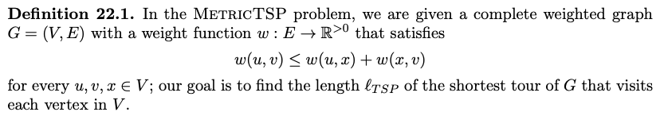
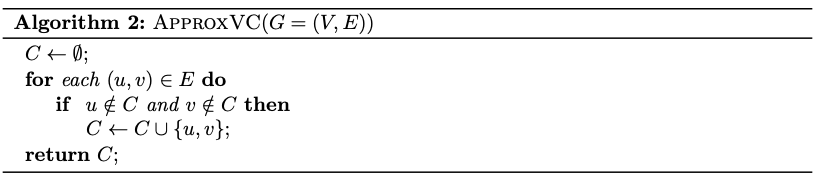
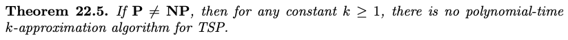

# Definitions

**k-Approximation Algorithm** - for any $k \geq 1$ and any minimization problem $P$, a k-approximation algorithm is an algorithm $A$ where for every instance $x$ of $P$ with optimal value $OPT$, the algorithm $A(x)$ outputs a solution with value at most $k \times OPT$

# Examples

## Metric TSP

2-approximation algorithm:

- Get MST (using Kruskal or Prim)
- In-order traversal of T (visits each vertex at least once, possible multiple times)
  - Left subtree
  - Root
  - Right subtree
- Final: short-cut those that re-visit a node
  - Left subtree -> right subtree

Proof:

- Let $l_{OPT}$ be the true optimal TSP tour, and $l_{MST}$ be the total length of the MST
  - $l_{MST} \leq l_{OPT}$ since a TSP tour needs to go through every edge in MST and come back to the first node
- Let $l$ be the length returned by the algorithm
  - $l \leq 2 \times l_{MST}$ since an in-order traversal vists each edge of the MST at most twice
- Therefore, $l \leq 2 \times l_{OPT}$

## Vertex Cover

Greedy algorithm

- Check every edge
  - If none of the end points are in $C$, add both of them in $C$
  - Else (at least one of them is in $C$), then do nothing as we are covered

This is also a 2-approximation algorithm

Proof:

- Let $C_{OPT}$ be the true optimal vertex cover, and let $C$ be the set returned by our algorithm
- Consider $M \in E$ be the set of edges that caused the algorithm to add $u, v$ to $C$
  - $|C| = 2 \times |M|$ since we add both vertices
  - No two edges in $M$ can share a common end vertex, otherwise we wouldn't have needed to add one of them's endpoints
- Then, we also have $|M| \leq |C_{OPT}|$ since, well, any vertex cover must include at least one of the end vertices of each edge in $M$
- Therefore, $|C| \leq 2 \times |C_{OPT}|$

## TSP Revisited

We can prove this by contradition

- If we do have an algorithm $A$ that is a k-approximation algorithm for TSP, then we can use it to solve an NP-complete problem HamCycle