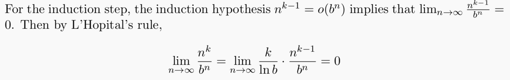
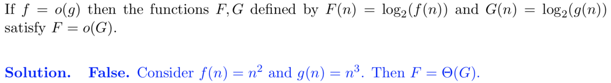

## Computational Model

**Definition (Word RAM Model)** - the *Word RAM* model is the computation model in which for an algorithm run on an input of size *n*,

- The memory of the algorithm is broken up into *word* of length *w* (typically, *w* = ), and
- Any elementary operation (read, write, add, multiply, AND, etc.) on any single word in memory takes 1 time step

## Asymptotic Analysis

**Definition (Worst-Case Time Complexity)** - the *worst-case time complexity* of an algorithm  is the function  obtained by letting  be the maximum time complexity of  over any input of size .

We care about the **asymptotic** rate of growth as the inputs get larger.

**Definition (Big-O Notation)** - two functions  satisfy  if **there exist**  and  such that for every , we have .

Big-O gives the asymptotic upper bound.

**Definition (Big- Notation)** - two functions  satisfy  if **there exist**  and  such that for every , we have .

Big- gives the asymptotic lower bound.

**Definition (Big- Notation)** - two functions  satisfy  **if and only if**  and .

Big- gives matching asymptotic upper and lower bounds.

**Definition (Little-o Notation)** - two functions  satisfy  if **for every** , there exists  such that for every , we have .

Little-o gives an upper bound that is not asymptotically tight.

**Definition (Little- Notation)** - two functions  satisfy  if **for every** , there exists  such that for every , we have .

Little- gives a lower bound that is not asymptotically tight

### Properties

### Techniques

- Compute 
  - If , then 
  - If , then  (i.e. also O and )
  - If , then  
- Induction might come in handy when computing limits (show that if  holds true, then  also holds true), especially when it's , so when you take derivatives, it becomes 

-  may not preserve order

- However, this is true for 
- Also however, if , then  is also 

