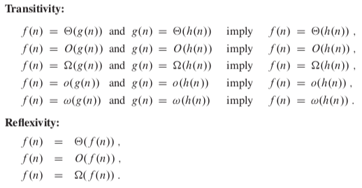
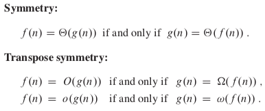
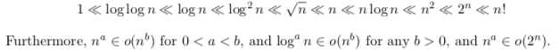
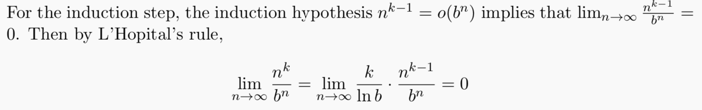
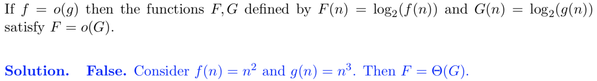

## Computational Model

**Definition (Word RAM Model)** - the *Word RAM* model is the computation model in which for an algorithm run on an input of size *n*,

- The memory of the algorithm is broken up into *word* of length *w* (typically, *w* = $\lceil\log{n}\rceil$), and
- Any elementary operation (read, write, add, multiply, AND, etc.) on any single word in memory takes 1 time step

## Asymptotic Analysis

**Definition (Worst-Case Time Complexity)** - the *worst-case time complexity* of an algorithm $A$ is the function $T_A : \N \longrightarrow \N$ obtained by letting $T_A(n)$ be the maximum time complexity of $A$ over any input of size $n$.

We care about the **asymptotic** rate of growth as the inputs get larger.

**Definition (Big-O Notation)** - two functions $f, g : \N \longrightarrow \R^{\geq 1}$ satisfy $f = O(g)$ if **there exist** $c \in \R^+$ and $n_o \in \N$ such that for every $n \geq n_o$, we have $f(n) \leq cg(n)$.

Big-O gives the asymptotic upper bound.

**Definition (Big-$\Omega$ Notation)** - two functions $f, g : \N \longrightarrow \R^{\geq 1}$ satisfy $f = \Omega(g)$ if **there exist** $c \in \R^+$ and $n_o \in \N$ such that for every $n \geq n_o$, we have $f(n) \geq cg(n)$.

Big-$\Omega$ gives the asymptotic lower bound.

**Definition (Big-$\Theta$ Notation)** - two functions $f, g : \N \longrightarrow \R^{\geq 1}$ satisfy $f = \Theta(g)$ **if and only if** $f = O(g)$ and $f = \Omega(g)$.

Big-$\Theta$ gives matching asymptotic upper and lower bounds.

**Definition (Little-o Notation)** - two functions $f, g : \N \longrightarrow \R^{\geq 1}$ satisfy $f = o(g)$ if **for every** $c \in \R^+$, there exists $n_o \in \N$ such that for every $n \geq n_o$, we have $f(n) < cg(n)$.

Little-o gives an upper bound that is not asymptotically tight.

**Definition (Little-$\omega$ Notation)** - two functions $f, g : \N \longrightarrow \R^{\geq 1}$ satisfy $f = \omega (g)$ if **for every** $c \in \R^+$, there exists $n_o \in \N$ such that for every $n \geq n_o$, we have $f(n) > cg(n)$.

Little-$\omega$ gives a lower bound that is not asymptotically tight

### Properties

### Techniques

- Compute $\lim_{n \to \infty}{\frac{f(n)}{g(n)}}$
  - If $= 0$, then $f(n) = o(g(n))$
  - If $= c$, then $f(n) = \Theta(g(n))$ (i.e. also O and $\Omega$)
  - If $= \infty$, then $f(n) = \omega(g(n))$ 
- Induction might come in handy when computing limits (show that if $k-1$ holds true, then $k$ also holds true), especially when it's $n^k$, so when you take derivatives, it becomes $k - 1$

- $\log$ may not preserve order

- However, this is true for $O, \Omega, \Theta$
- Also however, if $\log{f(n)} = o(\log{g(n)})$, then $f(n)$ is also $o(g(n))$

