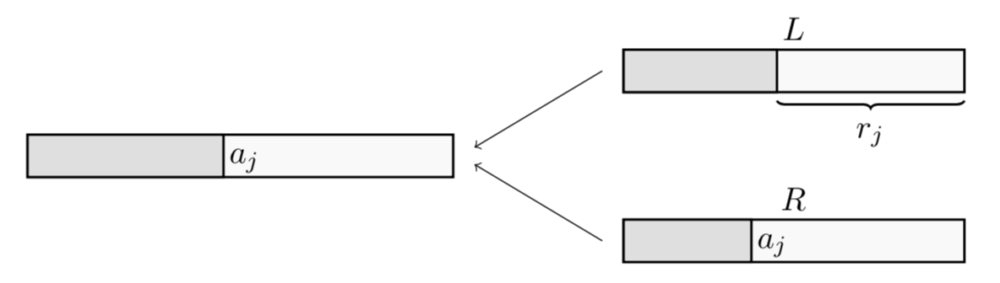

**Divide**: the original problems into small subproblems.

**Conquer**: each smaller subproblem separately

**Combine**: the results back together.

### Techniques - Inductions

Two steps

1. Guess an (ideally tight) upper bound on $T(n)$
2. Prove that your guess is correct using induction

Specifically

- Induction Hypothesis: for every $k < n$, $T(k) \leq cf(k) = O(f(k))$ (guess the upper bound)
- Base case: show that the Induction Hypothesis holds for all $k < a$  (pick some natural number $a$)
- Then, fix $x \geq a$, prove that $T(n) \leq cf(n) = O(f(n))$

Warnings

- $c$ must be the same! Proving that $T(n) \leq (c+1)f(n)$ doesn't work because then the bound grows. So, try guessing with a lower-power term: instead of guessing $T(n) \leq cn$, guess $T(n) \leq cn - d$
- It is worth checking that the guesses are as good as possible (i.e. tight)

### Techniques - Substitution  

Sometimes it's easier to substitute $n$ with some other variable.

E.g. let $m = \log{n} \Rightarrow n = 2^m$. Then, $T(n) = T(2^m) = S(m)$. If we can show that $S(m) = O(f(m))$, then this means that $T(n) = T(2^m) = S(m) = O(f(m)) = O(f(\log{n}))$

### CLRS - 4.3-9

$T(n) = 3T(\sqrt{n}) + \log{n}$

Solution:

Let $n = 2^m \Rightarrow m = \log{n}$.
$$
\begin{align*}
T(n) &= T(2^m) \\
&= 3T(2^{\frac{m}{2}}) + m \\
&= 3S(\frac{m}{2}) + m \\
&= S(m)
\end{align*}
$$
Using Master Theorem with $a = 3, b = 2, c = 1$,  we can see that $S(m) \in \Theta(m^{\log{3}})$

This means that
$$
\begin{align*}
T(n) &= T(2^m) \\
&= S(m) \\
&\in \Theta(m^{\log{3}}) \\
&= \Theta(\log{n}^{\log{3}})
\end{align*}
$$

### Example - Counting Inversions

Similar to MergeSort.

When combining, for every element $a_j$ in $R$, we need to know how many elemnts in $L$ that are larger than $a_j$. Then, $r = \sum_{j = \frac{n}{2} + 1}^{n}{r_j}$ . This is easy when both $L$ and $R$ are sorted.

 

$S$ is the (sorted) output array, $r$ is the number of cross-list inversions, and $|L|$ is the length of $L$ at that point.

If the minimum of $R$ is smaller than the minimum of $L$, then that number must also be smaller than everything else in of $L$, so we add $|L|$ to $r$.

This has time complexity $T(n) = 2T(\frac{n}{2}) + O(n)$, which is similar to MergeSort, so $T(n) = O(n\log{n})$.

