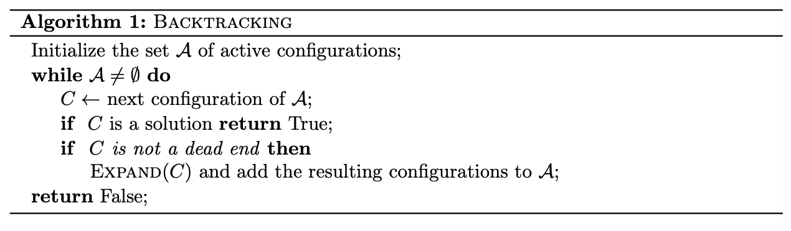
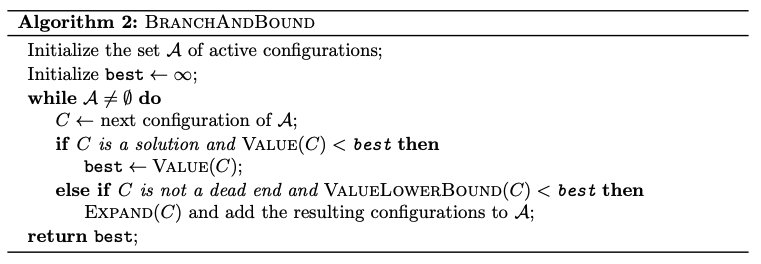
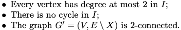

We are trying to design exponential-time algorithms in a way that guarantees they will be correct, and hopefully keep them as efficient as possible.

# Backtracking

**Configurations** - full/partial solutions in a tree solution

We can implement using **queue** (DFS) or **stack** (BFS). This depends on the width and height of the tree. ==DFS could be better because we only need to keep $O(n)$ active configurations in memory at any time, as opposed to $O(2^n)$ in BFS.==

# Branch-And-Bound

Very similar to backtracking, except now we also keep track of the best value so far. We discard any configuration if the potential for that configuration is no better than the best value so far.

In the above algorithm, we are interested in finding a minimum value, so *ValueLowerBound* checks if the potential minimum value of configuration *C* is better than the best so far or not, and does not expand on *C* if it's not better.

For checking dead end, in the case of the Travelling Salesman Problem, we check if any of these conditions is not satisfied:

