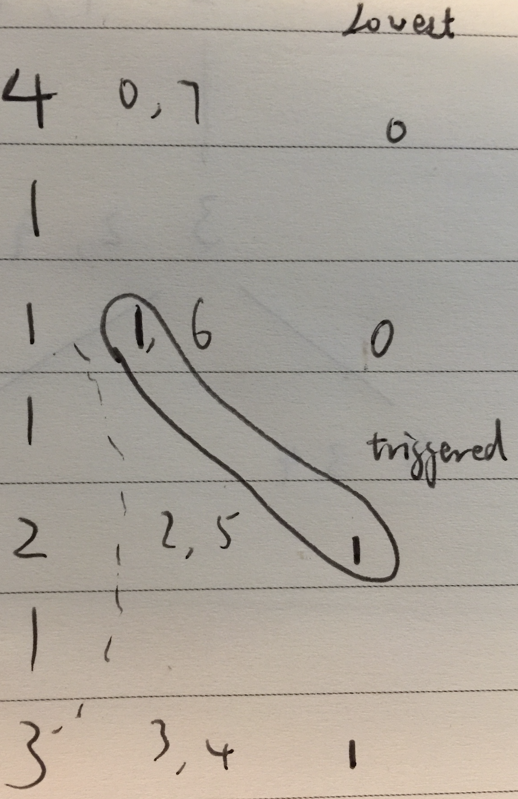
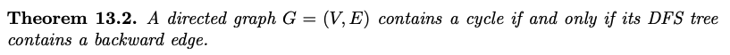
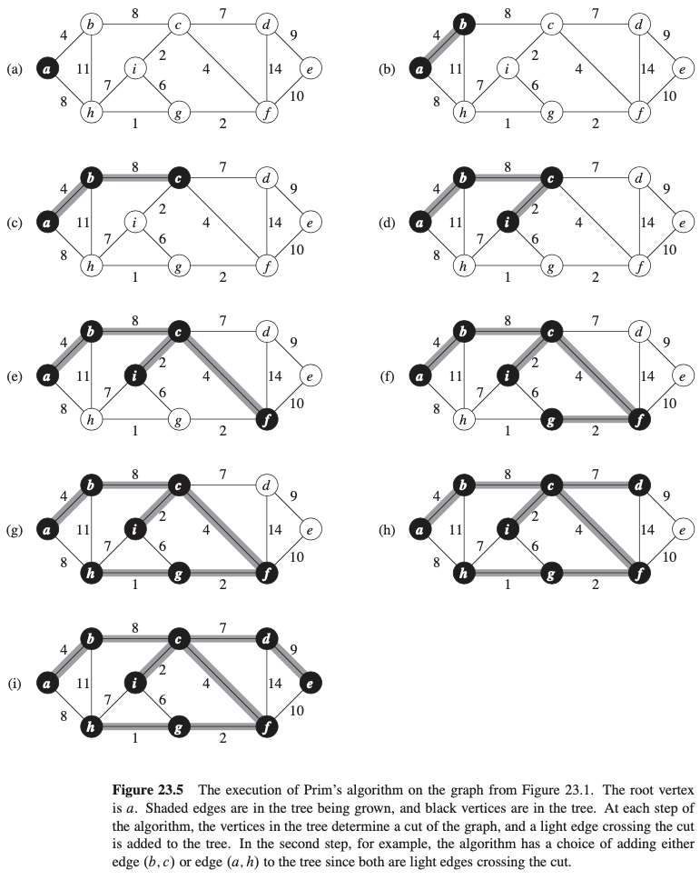
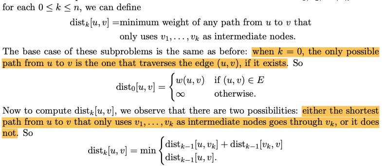

# Definitions

**Graph** - $G = (V, E)$ is a set V of **verticies/nodes** and a set E of **edges** connecting paris of vertices. We let $n = |V|$ denote the number of vertices in the graph, and $m = |E|$ denote the number of edges of the graph

**Unordered/undirected Graph** - edges are undirected

**Ordered/directed Graph** - edges are directed

**Adjacent** - two vertices are adjacent is they are connected by an edge. They are therefore **neighbours**

**Incident** - a vertex is incident to an edge if it is one of its endpoints

**Degree** - of a vertex is the number of edges to which it is incident, or the number of neighbours it has

**In/Out-degree** - degree, but in the context of a directed graph

**Path** - sequence of vertices with edges in between

**Simple Path** - a path in which no vertices appear more than once except possibly at the endpoints

**Cycle** - for undirected graphs, it is a path of at least 3 that starts and ends at the same vertex, and contains no other vertex repetitions. For directed graphs, it's possible to have a cycle of length 2 (e.g., $v_0 \rightarrow v_1 \rightarrow v_0$)

**Directed Acyclic Graph (DAG)** - a directed graph that contains no cycle

**Connected** - an undirected graph is connected if every two vertices in V is connected (reachable) by a path

**Connected component** - a maximal connected subgraph

**Tree** - a connected graph that does not contain any cycle, ==therefore it has exactly $n - 1$ edges==

**Bipartite** - a graph G is bipartitie if there is a partition of $V$ into two parts $V_L$ and $V_R$ such that every edge in $E$ connects a vertex in $V_L$ to one in $V_R$. For example:


**Spanning Tree** - a spanning tree of a connected graph $G = (V,E)$ is a tree $T = (V, E')$ where $E' \in E$ and $T$ is also a connected graph. These can be used to store a sparse representation of $G$ (with $n - 1$ edges) that still enables us to find a path between every two vertices

- **Tree edges** - edges contained in the tree
- **Non-tree edges** - edges that are not contained in the tree
- **Descendant** and **ancestor**

**Cut** - a cut in a graph is a partition of the vertices into two sets

- An edge is said to **cross** the cut if it connects two vertices one from each set

**Cut Vertex** - a vertex is a cut vertex when, if we remove it from the graph, then the graph becomes no longer connected. For example, vertex 1 is a cut vertex:


**2-Connected** - a graph is 2-connected if it has no cut vertex, as opposed to 1-connected, where there is a cut vertex

**Forward/Backward/Cross Edges** - types of non-tree edges for directed graph

- Forward - lead from an ancestor to a descendant. E.g. (5, 7)
- Backward - lead from a descendant to an ancestor. E.g. (6, 1), (5, 2)
- Cross - lead from a vertex to another one that is neither its ancestor nor its descendant. E.g. (6, 8), (8, 7)


**Source/Sink Vertex** - in a DAG, a source vertex is a vertex with in-degree 0, and a sink vertex is a vertex with out-degree 0

**Strongly Connected** - a directed graphis strongly connected if for every pair of vertices $u, v \in V$, there is a path from $u$ to $v$ and a path from $v$ to $u$. Basically, it's a fully connected graph

**Weighted Graphs** - each edge has weight. This comes as part of the minimum spanning tree problem

**Minimum Spanning Tree** - a spanning tree of a weighted graph with minimum total weight

****

# Graph Representations

**Adjacency matrix** - n x n, even when the graph is sparse. However, we can check if two vertices are adjacent to one another in constant time

**Adjacency list** - set of n linked lists, one for each vertex in the graph, in which the list associated with v stores all the neighbours of v in G. Space complexity of $O(n + m)$, much better than adjacency matrix. However, checking if two vertices are adjacent requires $O(n)$. But, identifying all the neighbours of a vertex v can be done in time $O(deg(v))$.

In the Word RAM model, where we set the word length to be $O(\log n)$ so that vertex labels can be stored in a single word.

# Breadth-First-Search

Adjavency list representation.

Uses a **queue** (FIFO).


- $L$ contains all the verticies

- Time-complexity: $O(n + m)$
  - Each vertex is added to the queue at most once, so $O(n)$
  - Adjacency list of each vertex is visited at most once (when that vertex is dequeued), so $O(m)$

## Single-Source Shortest Path (SSSP)


- Just added *dist* to standard BFS
- Time complexity : $O(m + n)$

## Testing Bipartiteness


- Assign $s$ to be in $V_L$
- Dequeue $v$
- For every vertex $w$ that we visit from $v$ that have not yet visited before, set it to be from the other part of the graph (if $v$ is from $V_L$, set $w$ to be from $V_R$)
- If we have visited $w$ before, then check if it is from the opposite part of $v$

##Spanning Tree


- Here we are representing the rooted tree with an array of $n$ nodes, where the entry for node $w$ is its parent $v$ in the tree and the entry for the root ($s$) has $\emptyset$ as its parent

# Depth First Search

==We could accomplish DFS with a **stack** (LIFO) instead of a queue in BFS.==

Or, we could use a simple recursive algorithm.


- *PreVisit* - add $v$ to $L$

- *PostVisit* - output $L$

- Time complexity: $O(n + m)$
  - *Explore* is called on at most $n$ verticies
  - For loop is executed $m$ times since each edge is visited at most twice

## Spanning Tree


We can modify *PreVisit* and *PostVisit* to keep track of order of visit, and when its completely explored


==The above lemma says that you can't have non-tree edges from a left-subtree to a right-subtree==


- (3, 4) and (5, 8) are disjoint
- (2, 9) and (6, 7) are contained within one another

## Finding Cut Vertices/Testing 2-Connectedness


This is a direct extention of Lemma 12.2 above.


Correction: it should have said "ancestor of $v$" not "ancestor of $T$".

Also a direction extension of Lemma 12.2 above. If the above Lemma is satisfied, then removing $u$ isolates the subtree rooted at $u$ from the rest of the graph, so the resulting subgraph is not connected.

Then, this problem is reduced to the problem of determining if a vertex satisfies either of the above conditions.


- Lemma 12.6 is easily checked in the first if statement
- *PreVisit* and *PostVisit* generates the *pre* and *post* visit time lists
- Lemme 12.7 is checked by
  - $lowest[w]$ contains the $pre$ value of the earliest ancestor that $w$ is connected to by an edge
  - If that value is greater than or equal to $pre[v]$, then we know that cutting $v$ would result in an isolated subgraph




# Depth First Search in Directed Graphs

We can run the DFS algorithm (in undirected setting) as-is on directed graphs, and the algorithm would build us a DFS tree.

==In the directed graph setting, we are no longer guaranteed to have non-tree edges connecting only ancestors and descendants (i.e. Lemma 12.2).==

## Directed Acyclic Graphs




If $(u, v)$ is a backward edge in the DFS tree for $G$, then the path from $v$ to $u$ in the tree along with the edge $(u, v)$ forms a cycle.

We can modify the DFS algorithm, and check if any of the non-tree edges encountered along the way is a backward edge by using the $post[v]$ values.

```python
def initialize_dictionary(V, val):
    output = {}
    for v in V:
        output[v] = val
    return output
  
def pre_visit(v, p):
    global clock
    pre[v] = clock
    clock += 1

def post_visit(v, p):
    global clock
    post[v] = clock
    clock += 1
    
def explore(G, v, p):
    print("--Exploring {0} from {1}".format(v, p))
    visited[v] = True
    pre_visit(v, p)
    for w in G[v]:
        if not visited[w]:
            explore(G, w, v)
        else:
            # We are still in the subtree under w
            # (v, w) is therefore a backward edge
            if post[w] == None:
                print("{0} has a cycle".format(w))
    post_visit(v, p)
```


```python
G = {1 : [2, 3],
     2 : [4],
     3 : [6],
     4 : [5, 7, 8],
     5 : [2, 7],
     6 : [1, 8],
     7 : [],
     8 : [7]}

visited = initialize_dictionary(G.keys(), False)
pre = initialize_dictionary(G.keys(), None)
post = initialize_dictionary(G.keys(), None)

clock = 0
```

```python
explore(G, 1, 0)
```

```
--Exploring 1 from 0
--Exploring 2 from 1
--Exploring 4 from 2
--Exploring 5 from 4
2 has a cycle
--Exploring 7 from 5
--Exploring 8 from 4
--Exploring 3 from 1
--Exploring 6 from 3
1 has a cycle
```

```python
for v in G.keys():
    print("{0}: ({1}, {2})".format(v, pre[v], post[v]))
```

```
1: (0, 15)
2: (1, 10)
3: (11, 14)
4: (2, 9)
5: (3, 6)
6: (12, 13)
7: (4, 5)
8: (7, 8)
```

## Topological Sorting of DAGs


- ==After DFS, we can sort the verticies by their $post[v]$ number to linearize G==
- In a linearization of G, the first vertex must be a source vertex, and the last vertex must be a sink vertex

## Strong Connectivity


We can do so by running DFS on

- $G$
- $G^R$, obtained by flipping the direction of every edge in $G$


# Minimum Spanning Trees


==Properties of MST==

- ==Cut Property: if $e$ is the min weight edge in a cut $E(S, V \setminus S)$, then $e$ is in every MST==
- ==Contraction: if $T$ is an MST for $G$, and $e \in T$, then $T \setminus e$ is an MST for $G \setminus e$ where we identify the end points of $e$ and remove $e$==
- ==Cycle Property: if $e$ is the max weight edge in a cycle in $G$, then $e$ is in no MST==

## Kruskal's Algorithm

Greedy algorithm - consider the edges in order of increasing weight, and add an edge to our tree whenever its endpoints are two vertices that have not already been connected.


- *Component* check basically checks if the two vertices belong to the same tree or not


- Time complexity $O(m\log{m})$
  - Only if we use Union Find data structure to implement the *Component* check piece


## Prim's Algorithm

Another greedy algorithm - find the lightest edge that connects the tree to another previously-unconnected vertex




- We can implement this using a priority queue.

- Time complexity : $O(m\log{m})$

# SSSP on Weighted Graphs

We had talked about SSSP on unweighted graphs (using BFS, $O(m + n)$)

## SSSP with Small Integer Weights

In this case, we can reduce the problem by adding in dummy vertices


Time complexity : $O(m' + n')$, where each are the number of edges and vertices of the unweighted graph we created.

## SSSP with Non-Negative Weights : Dijkstra's Algorithm

- ==BFS with priority queue==


- Time complexity : $O((m + n) \log n) = O(m \log n)$

## SSSP with Negative Edge Weights : Bellman-Ford Algorithm

- ==Assume no negative weight cycles!==
- Dynamic Programming. Subproblem:
  - ==We wish to determine $d_i[v]$, the length of the shortest path from $s$ to $v$ that uses at most $i$ edges==


- Simplied to use only one vector $d$ instead of $n - 1$ vectors
- Basically, we check for $m$ edges, $n$ times
- Time complexity : $O(mn)$

# All Pairs Shortest Path


## With SSSP Bellman-Ford

Just run Bellman-Ford for all vertices


- Time complexity : $O(mn^2)$
- Inefficient - each call to the BF algorithm results in teh computation of a lot of shortest paths that end up being discarded when we call it again with another source vertex

## With Modified APSP Bellman-Ford

Still the same subproblem


However, this one still has time complexity of $O(mn^2)$. We need a better subproblem

## Floyd-Warshall Algorithm

==Instead of limiting the number of edges that the paths can use, now limit the set of intermediate nodes that these paths can traverse.==

First, label the vertices as $v_1, v_2, ..., v_n$.




- Time complexity : $O(n^3)$