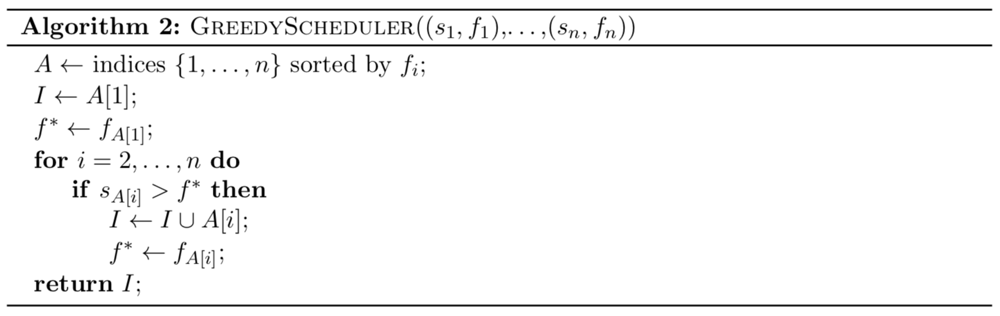
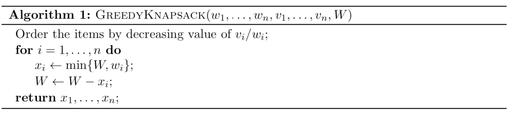
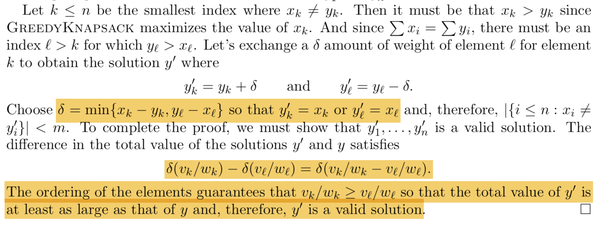

A *greedy* algorithm is one in which we:

1. Breakdown a problem into a sequence of decisions that need to be made, then
2. Make the decisions one at a time, each time choosing the option that is optimal **at the moment** (and not worrying about later decisions)

## Always Ahead

We show that at every point in the execution of our greedy algorithm, we can complete the partial solution we have obtained so far into a valid solution to the original problem.

### Proof Framework

First, we need to show the base case:

- Define  to be the *true* optimal solution
- Define  to be the **first** index that our algorithm returns
- Show that  is also a valid (optimal) solution

Then, let the algorithm output be .

We need to show that  is also a valid (optimal) solution via induction

- Assume  is a solution
- Show that  is also a solution

Lastly, show that  by making structural arguments of the algorithm (e.g. the algorithm returns up until  only if all other intervals with finish time greater than  interset with some intervals already in ).

### Example - Interval Scheduler

## Exchange

We show that given any valid solution to the problem, we can convert it to the algorithm output without compromising the metric.

### Proof Framework

1. (If necessary) assume w.o.l.g. that the arrays are sorted in increasing/decreasing order
2. Let  be any arbitrary solution (not necessarily the optimal solution), and  be the solution produced by our algorithm
3. If , then there is consecutive/some pair where ...
4. Therefore, the current measure, in  is ...
5. If we swap ... in , the new measure would be ..., which **proves to be better than before**. May also need to prove that the new solution is valid.
6. If we iterately swap out of order pairs, we will eventually stop because
   1. There can be at most (n choose 2) possible swaps
   2. $S^* = S^{\dagger}$
7. Since we improve the measure along the way, this establishes that  is better than , so  is the optimal solution

### Example - Fractional Knapsack

