## Reduction

- ==2Sum==

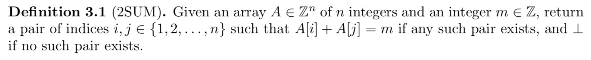

Run time = 

- ==3Sum==

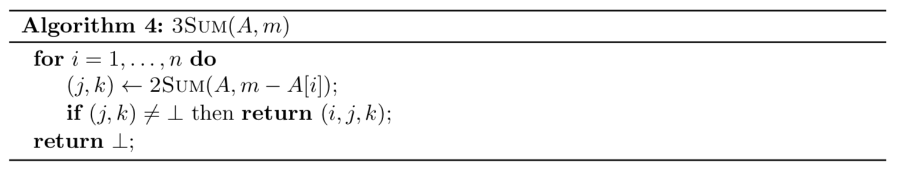

Run time = , actually  since we only need to sort once at the beginning

- ==MergeSort==

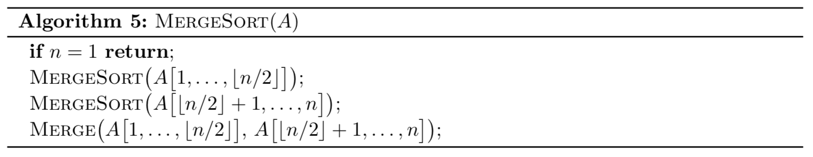

Run time = 

## Divide and Conquer

- ==Counting Inversions==

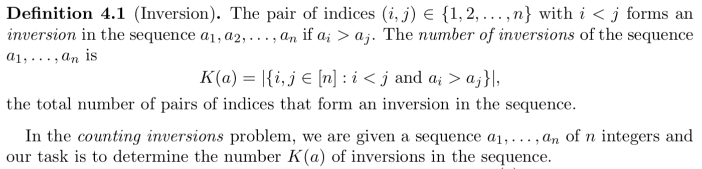

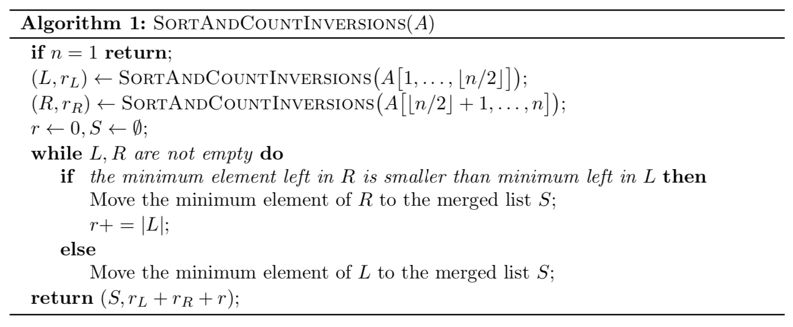

Run time = 

- ==Fast Integer Multiplication==

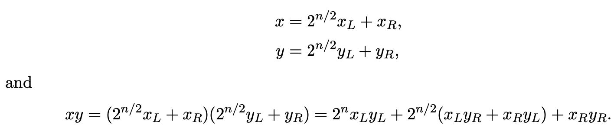

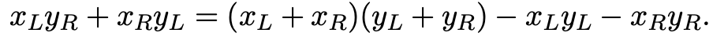

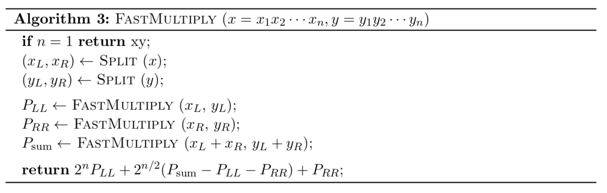

, as opposed to  if we were to do normal multiplication

Run time = 

- ==Fast Matrix Multiplication - **Strassen's Algorithm**==

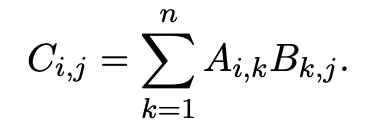

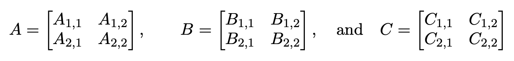

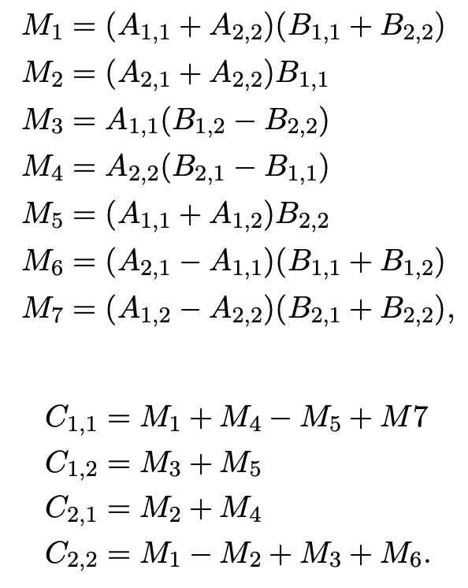

## Greedy

- ==Making Change==

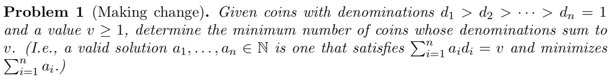

Run time = 

- ==Interval Scheduling (non-weighted)==

Strategy: earliest finish time

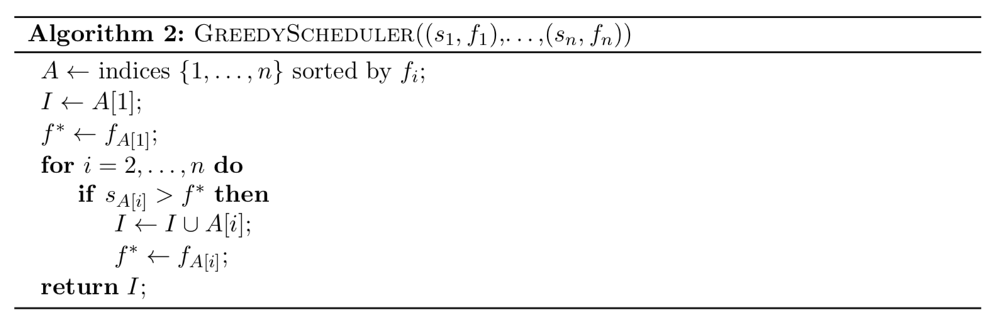

Run time = 

- ==Minimizing Lateness==

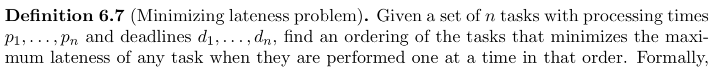

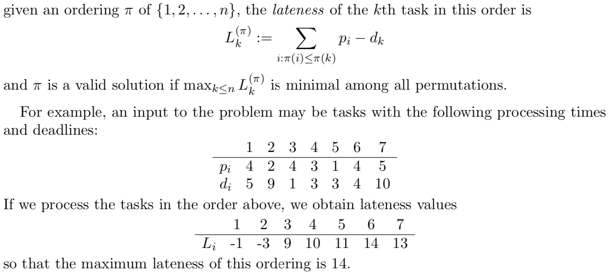

Strategy - earliest deadline

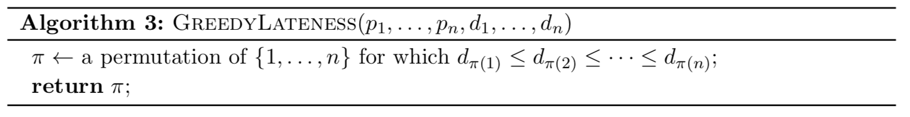

Run time = 

- ==Interval Colouring==

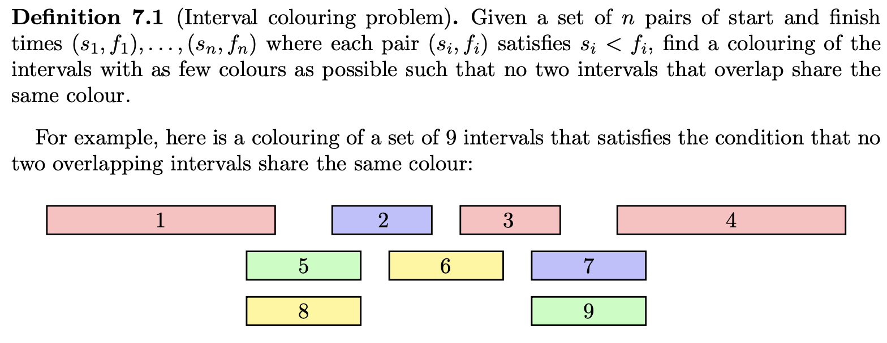

Run time = , since we need to sort by start time

- ==Fractional Knapsack==

Strategy - sort by decreasing 

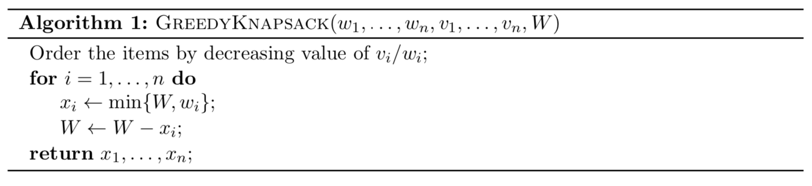

Run time = , since we need to sort by 

## Dynamic Programming

- ==Text Segmentation==

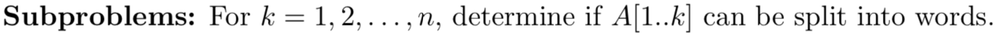

Run time = 

- ==Longest Increasing Subsequence==

Run time = 

- ==Longest Common Subsequence==

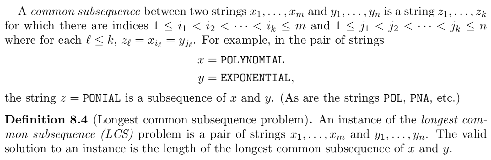

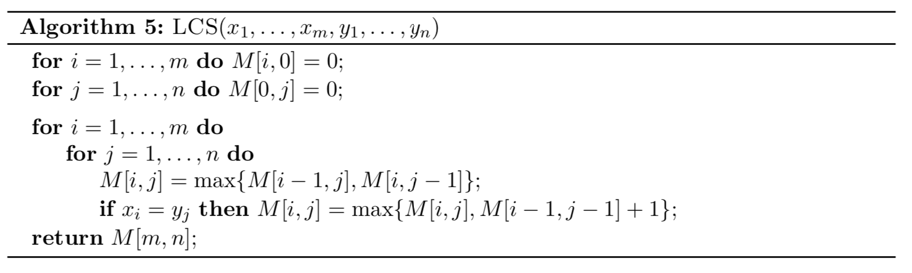

Run time = 

- ==Edit Distance==

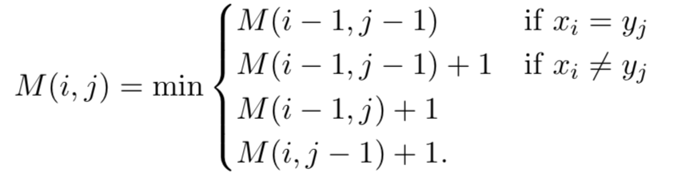

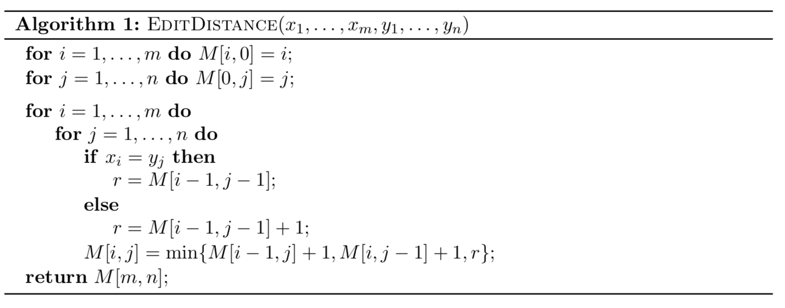

Run time = 

- ==Interval Scheduling (weighted)==

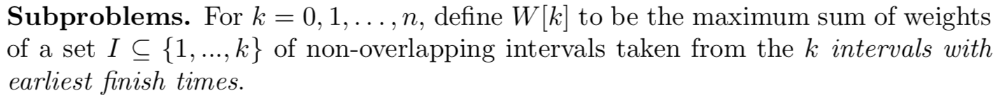

Run time =  since we've sorted by finish time

- ==Optimal Binary Search Tree==

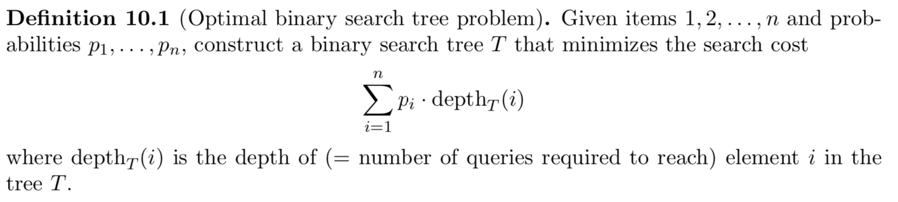

Runt time = 

- ==0-1 Knapsack==

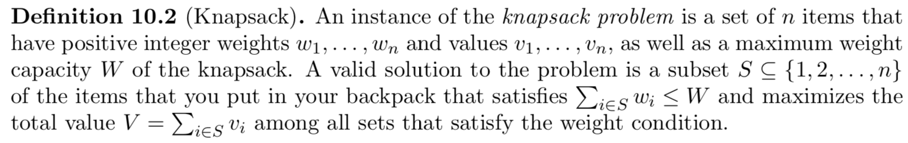

Run time = 

