## Reduction

- ==2Sum==

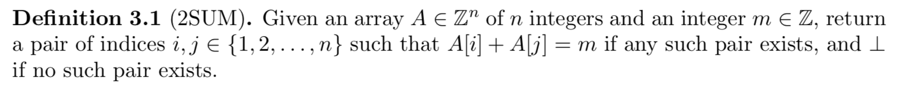

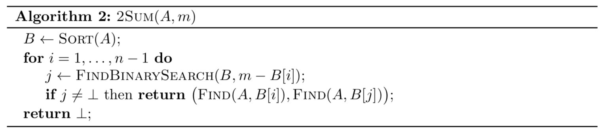

Run time = $\Theta(n\log{n})$

- ==3Sum==

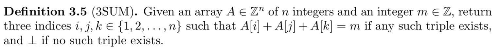

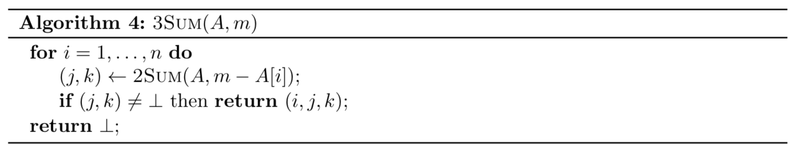

Run time = $\Theta(n^2\log{n})$, actually $\Theta(n^2)$ since we only need to sort once at the beginning

- ==MergeSort==

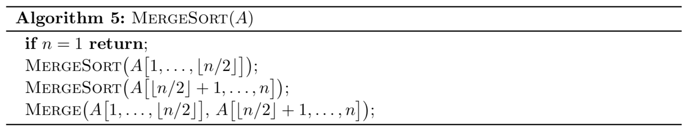

Run time = $\Theta(n\log{n})$

## Divide and Conquer

- ==Counting Inversions==

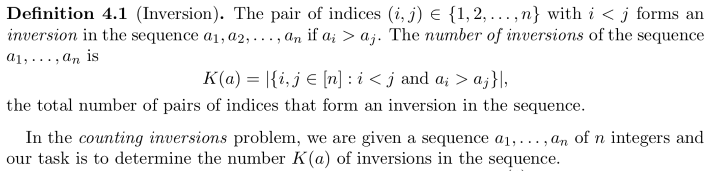

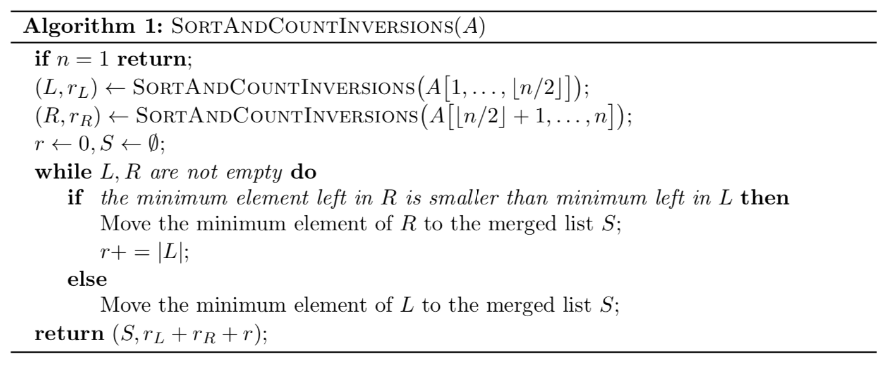

Run time = $O(n\log{n})$

- ==Fast Integer Multiplication==

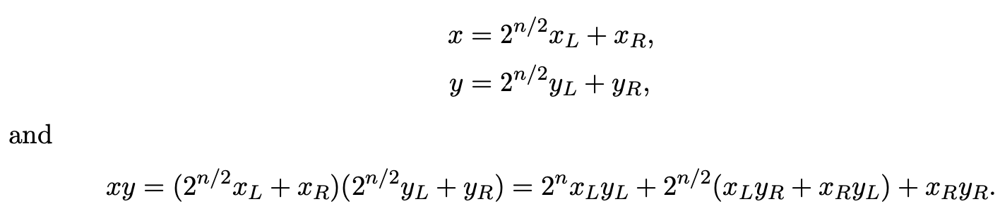

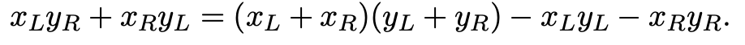

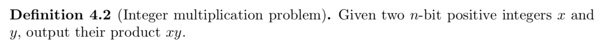

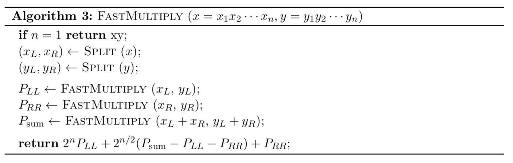

$T(n) = 3T(\frac{n}{2}) + O(n)$, as opposed to $T(n) = 4T(\frac{n}{2}) + O(n)$ if we were to do normal multiplication

Run time = $O(n^{\log_{2}{3}}) = O(n^{1.59})$

- ==Fast Matrix Multiplication - **Strassen's Algorithm**==

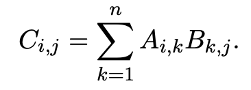

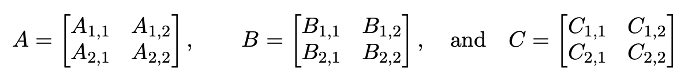

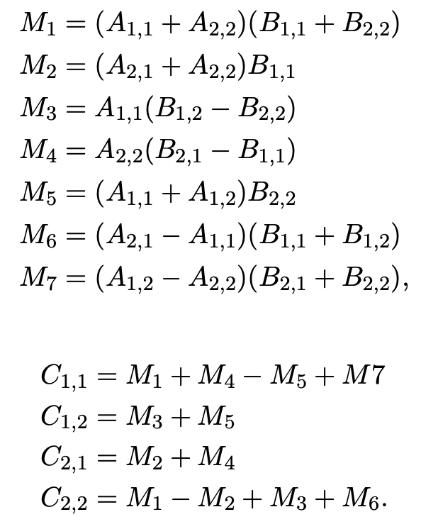

$T(n) = 7T(\frac{n}{2}) + O(n^2) = O(n^{\log_{2}{7}}) = O(n^{2.81})$

## Greedy

- ==Making Change==

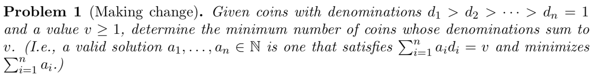

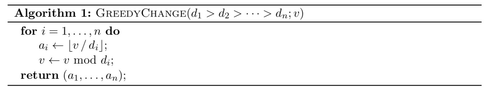

Run time = $O(n)$

- ==Interval Scheduling (non-weighted)==

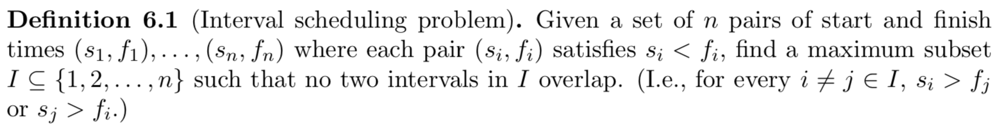

Strategy: earliest finish time

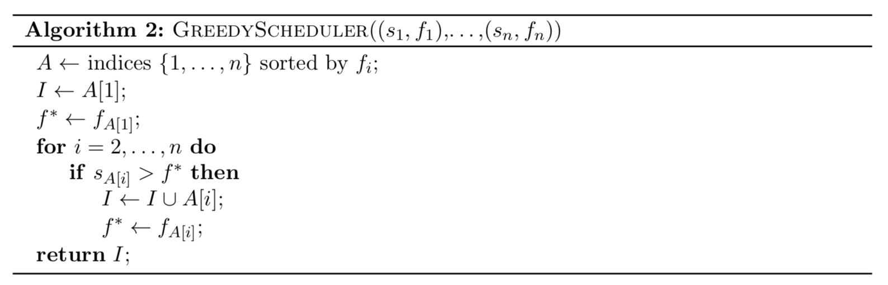

Run time = $\Theta(n\log{n})$

- ==Minimizing Lateness==

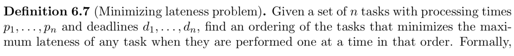

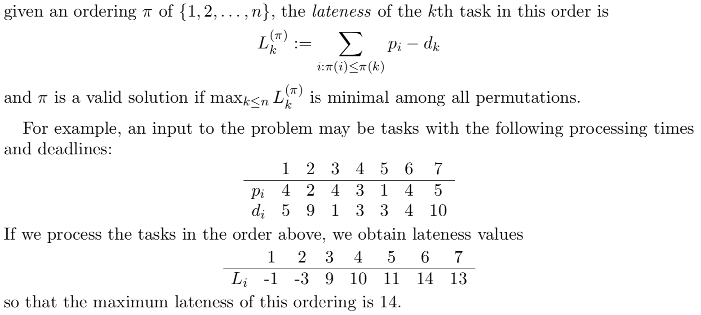

Strategy - earliest deadline

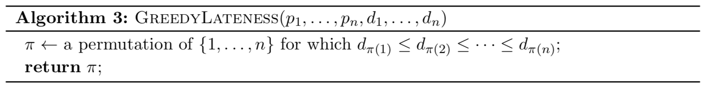

Run time = $O(n^2)$

- ==Interval Colouring==

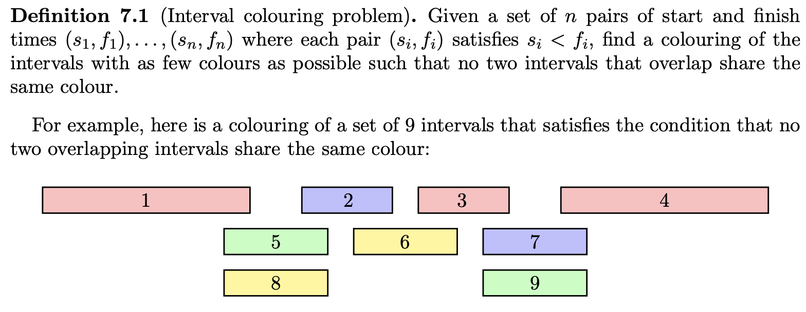

Run time = $O(n \log n)$, since we need to sort by start time

- ==Fractional Knapsack==

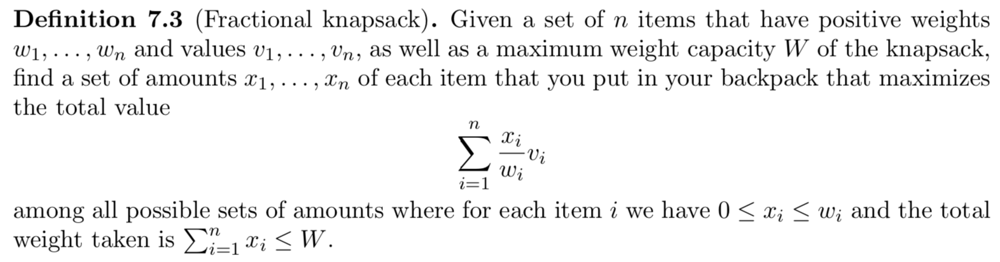

Strategy - sort by decreasing $\frac{v_i}{w_i}$

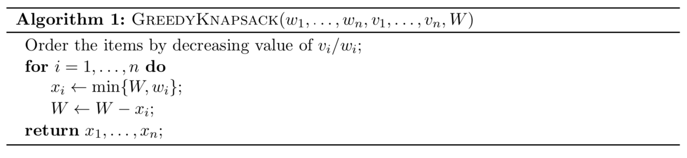

Run time = $O(n \log n)$, since we need to sort by $\frac{v_i}{w_i}$

## Dynamic Programming

- ==Text Segmentation==

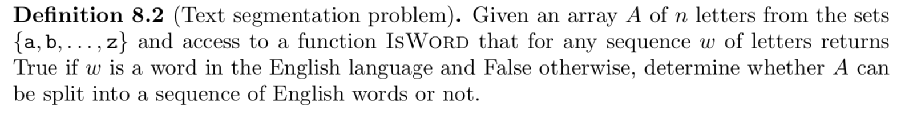

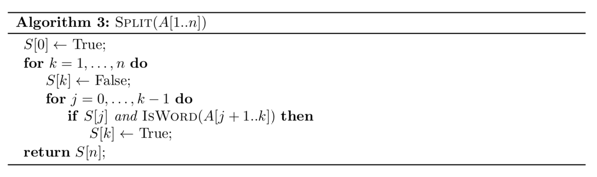

Run time = $O(n^2)$

- ==Longest Increasing Subsequence==

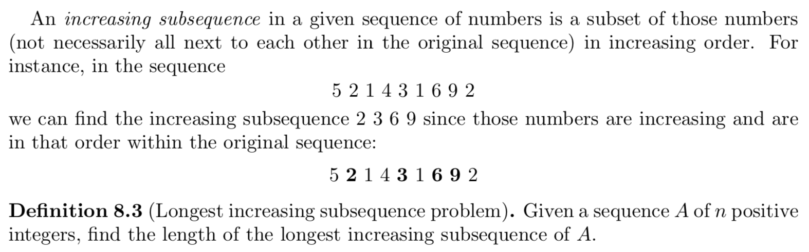

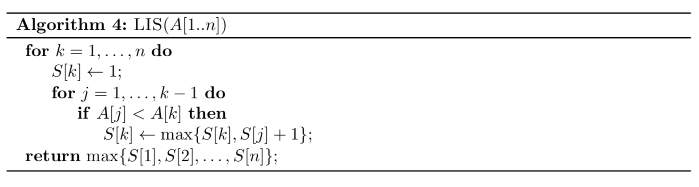

Run time = $O(n^2)$

- ==Longest Common Subsequence==

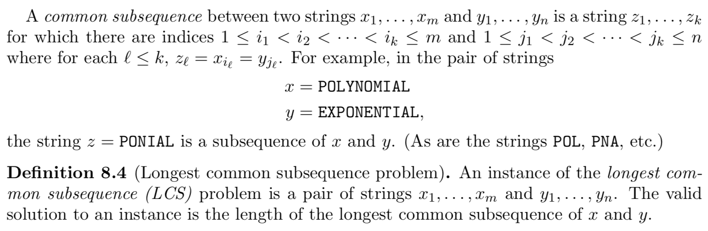

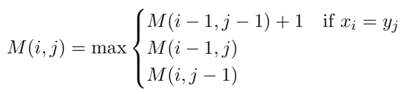

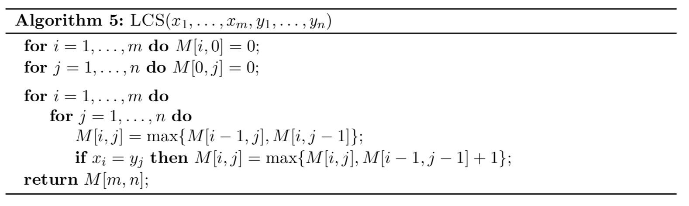

Run time = $\Theta(mn)$

- ==Edit Distance==

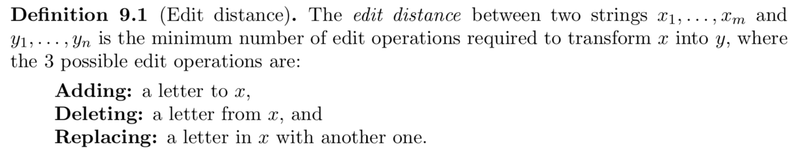

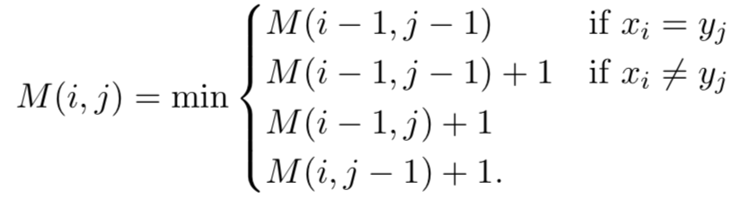

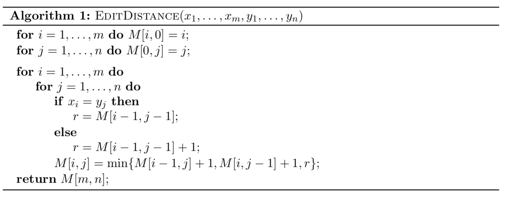

Run time = $O(mn)$

- ==Interval Scheduling (weighted)==

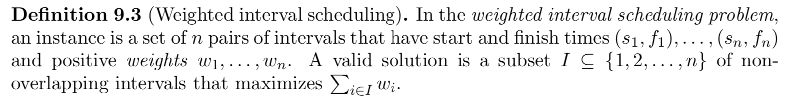

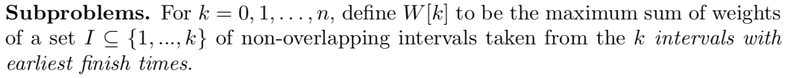

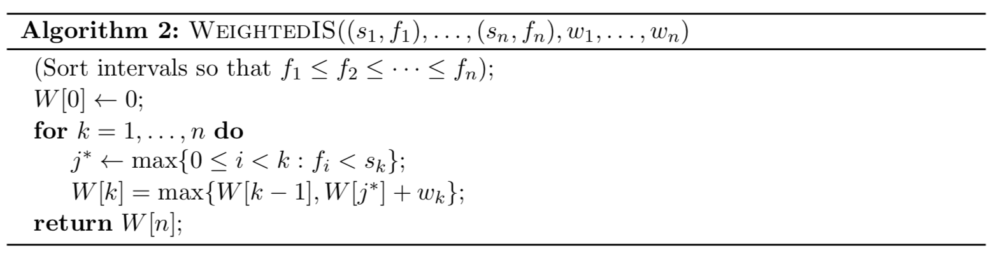

Run time = $O(n\log{n})$ since we've sorted by finish time

- ==Optimal Binary Search Tree==

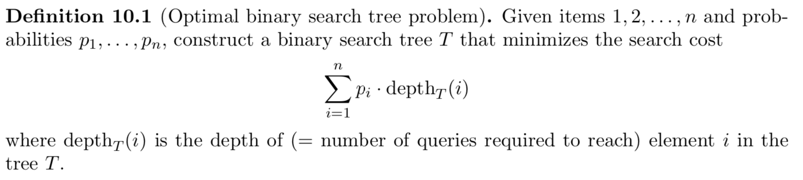

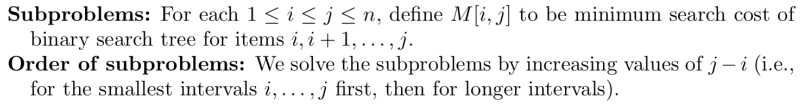

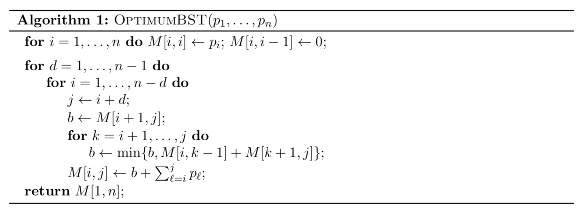

Runt time = $O(n^2)$

- ==0-1 Knapsack==

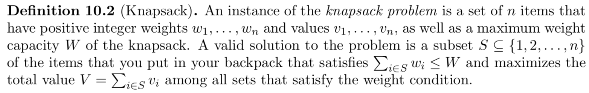

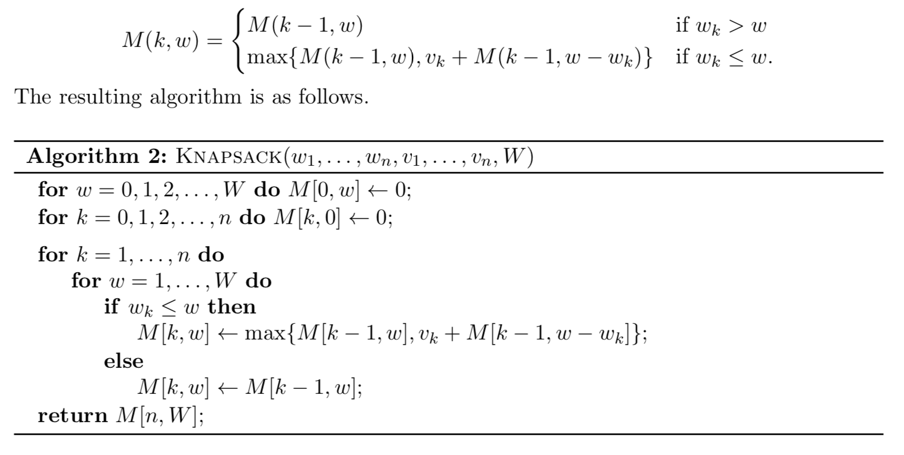

Run time = $\Theta(nW)$

