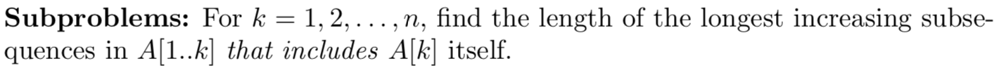

## Reduction

- 2Sum

Run time = $\Theta(n\log{n})$

- 3Sum

Run time = $\Theta(n^2\log{n})$

- MergeSort

Run time = $\Theta(n\log{n})$

## Divide and Conquer

- Counting Inversions

Run time = $O(n\log{n})$

- Integer Multiplication

Run time = $O(n^{\log_{2}{3}}) = O(n^{1.59})$

## Greedy

- Making Change

Run time = $O(n)$

- Interval Scheduling (non-weighted)

Strategy: earliest finish time

Run time = $\Theta(n\log{n})$

- Minimizing Lateness

Strategy - earliest deadline

Run time = $O(n)$

- Fractional Knapsack

Strategy - sort by decreasing $\frac{v_i}{w_i}$

Run time = $O(n)$

## Dynamic Programming

- Text Segmentation

Run time = $O(n^2)$

- Longest Increasing Subsequence

Run time = $O(n\log{n})$

- Longest Common Subsequence

Run time = $\Theta(mn)$

- Edit Distance

Run time = $O(mn)$

- Interval Scheduling (weighted)

Run time = $O(n\log{n})$

- Optimal Binary Search Tree

Runt time = $O(n^2)$

- 0-1 Knapsack

Run time = $\Theta(nW)$

