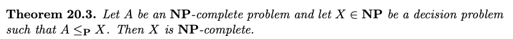

# Definitions

**Polynomial-Time Algorithm** - there exists a constant $k$ such that on any input of size $n$, the algorithm runs in time $O(n^k)$. ==Here, we measure the size of the input in terms of the number of bits required to encode the input, as opposed to the number of entries.==

**P** - the set of all **decision problems** (possible outputs are True or False) that can be solved by polynomial-time algorithms.

**Polynomial-Time Reducible** - the decision problem $A$ is polynomial-time reducible to the decision problem $B$ (written as $A \leq_P B$) if there's a polynomial-time algorithm $F$ such that, on ==any input== $I_A$ to the problem $A$, produces an input $I_B$ to the problem $B$ that ==has the same answer==

**Clique** - a subset of vertices of an undirected such that every two distinct vertices in the clique are adjacent.  Basically, it's the same as saying its a subset that's complete.

**Indepent Set** - a subset of vertices of an undirected such that NO two distinct vertices are adjacent. Basically, it's anti-clique.

**Vertex Cover** - a subset of vertices that "cover" all the edges in the sense that, at least one of the endpoints is in the subset

**Set Cover** - given a collection $S$ of subsets of $\{1, 2, ..., m\}$ and a position integer $k$, determine if there are $k$ sets $S_1, ..., S_k$ such that $S_1 \cup ... \cup S_k = \{1, 2, ..., m\}$

**Non-Empty** - a graph is non-empty if it has at least one edge

**Hamiltonian Path** - a set of paths visits each and every vertex exactly once

**Hamiltonian Cycle** - a Hamiltonian Path that is a cycle

**Verifier** - for the decision problem X is an algorithm A that takes in as input x to problem X and an additional input (**certificate**) y such that

- For every True input x to X, ==there is a certificate y== that causes A(x, y) to return True
- For every False input x to X, ==there is no certificate y== that can make A return True

**NP** - the set of all decision problems that have polynomial-time verifiers

**NP Complete** - a decision problem $X$ is NP-complete if

- $X \in NP$
- For every problem $A \in NP$, $A \leq_P X$

**NP Hard** - a decision problem $X$ is NP-hard if

- For every problem $A \in NP$, $A \leq_P X$
- ==$X$ does NOT need to be in NP== (almost always, but not entirely always)

**Many-One Reduction** - a decision problem $A$ is a polynomial-time many-one reducible to a decision problem $B$, written as $A \leq_P B$, iff there exists a polynomial time algorithm $F$ such that for every instance $x$ of $A$, $x$ is a YES instance iff $F(x)$ is a YES instance of $B$

# P

Why are we interested in polynomial time? If we can show a problem is intractable (i.e. no polynomial time solution), then it doesn't matter if our algorithm is not the right one because no reasonable modification to the algorithm can affect its tractability.

==Longest Increasing Subsequence (LIS) $\leq_P$ Longest Common Subsequence (LCS)==

- $F$ - the algorithm that sorts $inp$ in increasing order to produce $out$
- Pass both $inp$ and $out$ into LCS
- The result has a longest common subsequence of length at least $k$ iff the original sequence $inp$ had a longest increasing subsequence of length at least $k$

==Clique $\leq_P$ IndepSet, and IndepSet $\leq_P$ Clique==

- Just take the compliement graph

# Reductions and NP

==NonEmpty $\leq_P$ Clique==

- Just pass in $k = 2$ into Clique, since an edge is a clique of size 2

==IndepSet $\leq_P$ VertexCover==

- If G contains an independent set $I \in V$ of size $k$, then the set $S = V \setminus I$ is a vertex cover of size $n - k$, since no edge can have both endpoints in $I$ since it is an independent set

==VertexCover $\leq_P$ SetCover==

==Transitivity:==

Therefore:

==NonEmpty $\leq_P$ Clique $\leq_P$ IndepSet $\leq_P$ VertexCover $\leq_P$ SetCover==

==NOT symmetric==:

e.g. Clique $\leq_P$ NonEmpty?

==Clique $\in NP$==

- Potential certificate: a set $S \in V$ of size $|S| = k$
- Given a certificate, iterate through all pairs of the set
  - If no edge, return False
  - If at least one edge, return True
- A True certificate exists iff $G$ contains a clique of size $k$

==This DOES NOT mean that IndepSet, VertexCover, and SetCover are all $\in NP$. We need to provide certificates and verifiers to show them (trivial)==

==SubsetSum $\in NP$==

- Potential certificate: a subset $S \in \{1, 2, ..., n\}$
- Given a certificate
  - If sum = $t$ (target), return True
  - Else, return False
- A True certificate exists iff there is a subset that sums up to the target

## NP Complete

Because of the transitivity of polynomial-time reductions, we just need to show that one NP-complete problem $A$ satisfies $A \leq_P X$ in order to prove that $X$ is NP-complete.

==3SAT is NP-complete== (Cook-Levin Theorem)

- 3SAT is first of all NP because you can just put in any potential certificate and verify it in polynomial time (one pass through)

==Clique is NP-complete==

- We need to show that 3SAT $\leq_P$ Clique

==IndepSet, VertexCover and SetCover are all NP-complete==

- We've said in previous section that these three are all NP
- Then, Theorem 20.3 says that these three are NP-complete

==DirHamPath is NP-complete==

==HamPath is NP-complete==

==HamCycle is NP-complete==

- HamCycle is NP because it's trivial
- HamPath $\leq_P$ HamCycle
  - Add a point $s$ to $G$, and connect it to every point in $G$ to get $G'$
  - HamPath in $G$ iff HamCycle in $G'$

==SubsetSum is NP-complete==

- 3SAT $\leq_P$ SubsetSum

# Summary of Proof Procedures

To show that $X \in P$

-  Derive tha algorithm!

To show that $A \leq_P B$

- If we are proving NP-completeness, use the many-to-one reduction (==when in doubt, use this!==)
  - Find F
  - Transform $input_A$
  - Show that $output_B$ and $output_B$ are always consistent (True in A iff True in B)
- Otherwise (e.g., reducing between an optimization and a decision problem), use Turing reductions
  - Assume that there's a polynomial time algorithm for B
  - Find polynomial-time transformation F that takes in $input_A$ and transforms into $input_B$
  - Runs the algorithm in B using $input_B$
  - Use $output_B$ to derive $output_A$ correctly (polynomial-time algorithm!)
  - If we can do this in ==polynomial number of calls to B==, then $A \leq_P B$
    - Sometimes (e.g., A8Q1ii), we may need exponential number of calls to B, so we can't use this prove anything

To show that $B$ is NP-complete given another $A$ is NP-complete

- Show $B$ is in NP
- Show $A \leq_P B$

If $A \leq_P B$, then

- If A is in P, then we don't know anything about B
- If A is in NP, then we don't know anything about B
- If A is in NP-complete, then we don't know anything about B (since B may not be in NP)
- ==If A is in NP-hard, then B is in NP-hard== (since B doesn't need to be in NP)
- ==If B is in P/NP/NP-complete, then A is in P/NP/NP-complete==
- If B is in NP-hard, then we don't know anything about A

