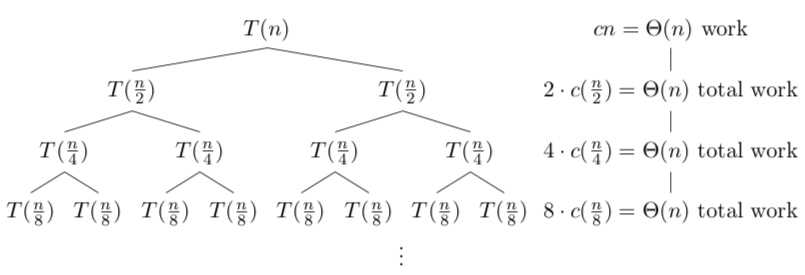
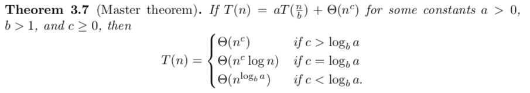
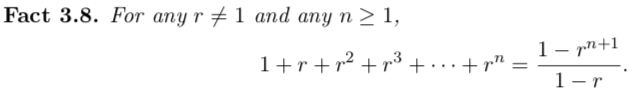

## Reduction

Reduction - use known algorithms to solve new problems.

### 2Sum

*2Sum* can be solved by

- Brute force - $O(n^2)$
- Sorting, and then then binary search on $m - B[i]$ for every $i$ - $O(n\log{n})$

### 3Sum

*3Sum* can be reduced to *2Sum*

- We want $A[i] + A[j] + A[k] = m$
- For every $k$, run *2Sum* with target $m - A[k]$

Total run time - $O(n \cdot n\log{n}) = O(n^2\log{n})$

However, notice that we only need to sort once, so the run time is actually $O(n\log{n}) + O(n^2) = O(n^2)$.

## Recursion

Recursion is a special type of reduction, where we reduce the original problem to the *same* problem, but on a *smaller* input.

$T(n)$ is the time complexity of the algorithm on arrays with $n$ entries.

### MergeSort

$$T(n) = T(\lfloor\frac{n}{2}\rfloor) + T(\lceil\frac{n}{2}\rceil) + \Theta(n)$$

Assume that $n$ is a power of 2, then

$$T(n) = 2T(\frac{n}{2}) + \Theta(n)$$

Recurrent tree:

The recurrence tree has

- Depth $\log{n}$
- $\Theta(n)$ of work at each level on compelting the merge

Total time complexity - $T(n) = \Theta(n\log{n})$

### Master Theorem

### Geometric Series

Then, for

- $0 < r < 1$, $f : n \longrightarrow 1 + r + r^2 + ... + r^n = \Theta(1)$ 
- $r < 1$, $f : n \longrightarrow 1 + r + r^2 + ... + r^n = \Theta(r^n)$ 

