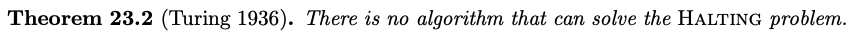
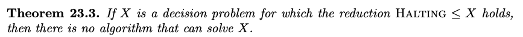

**Undecidable Problem** - problem that cannot be solved by any algorithm whatsoever

**Halting Problem** - given as input the binary code for an algorithm, determine whether the code halts after a finite number of steps on ==every input==

Examples of impossible problems (algorithms that may/may not halt):

- Collatz(x)
- Goldbach's conjecture (every even number can be represented as a sum of two primes)

We can prove that a problem is impossible to solve using reduction. ==In this case the reduction does not need to run in polynomial time.==

